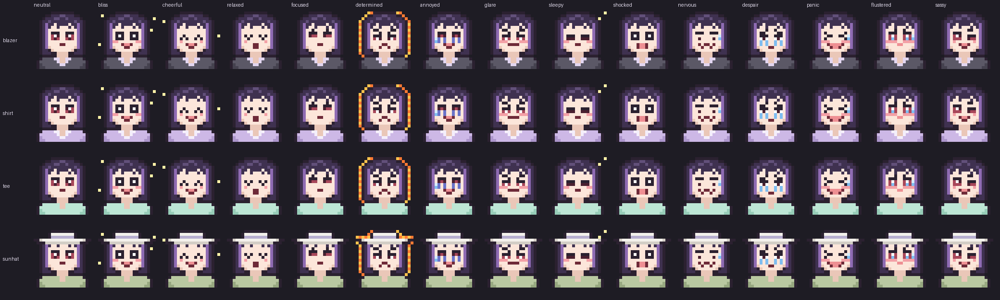

# Tally — Claude tracker mascot

A small pixel-art mascot for a terminal usage tracker. The **model** in use sets her outfit, and **usage and activity** set her expression.
Her style is based on the reference screenshots in `../assets/`: a dark-violet bob with a purple inner streak, rose eyes, and chibi reaction faces.



## Size

| Tier | Footprint | Use |
|---|---|---|
| Sprite | 20 cols × 10 rows (20×20 px, half-block) | main widget |
| Kaomoji | one line, 5–9 chars | status line / ultra-compact mode |

## Layout

```
mascot/
  manifest.json          models → outfit, expressions, animation timelines, state rules, kaomoji
  sprites.json           raw pixel grids + palette (render in any framework)
  ansi/truecolor/{outfit}/{expression}.{frame}.ans   ready-to-print, 24-bit colour
  ansi/ansi256/{outfit}/{expression}.{frame}.ans     fallback for 256-colour terminals
  png/{outfit}/{expression}.{frame}.png              12× PNGs (docs, GUI, notifications)
  preview/contact_sheet.png
  tools/build_mascot.py  SOURCE OF TRUTH — edit here, rerun to regenerate everything
  tools/preview.py       view in terminal: `python mascot/tools/preview.py tee panic --animate`
```

`.ans` files are UTF-8 text with ANSI escapes, 10 lines each; print them as-is (on Windows, make sure stdout is UTF-8 and VT processing is on). The transparent pixels print as plain spaces after a reset, so the sprite sits on the terminal's own background.

## Model → outfit

Match a substring of the model id (e.g. `claude-opus-5-5` → `opus`).

| Model | Outfit | Accent | Reference |
|---|---|---|---|
| opus | `blazer` — grey work suit | `#d97757` | 28, 441, 442 |
| sonnet | `shirt` — lavender blouse | `#9b7fd1` | 30–33, 35 |
| haiku | `tee` — mint lounge tee | `#5fbf9f` | 70–72 |
| fable | `sunhat` — white hat, sage tee | `#d9a441` | 430, 67 |
| unknown | `shirt` | `#9b7fd1` | |

Use the accent colour for UI chrome such as bars and borders to keep the whole widget themed to the model.

## Expressions → state

`manifest.json › state_rules` lists these rules in priority order; the first match wins. `usage_pct` = current session/5-hour window, `weekly_pct` = weekly cap.

| Expression | When | Frames |
|---|---|---|
| `sassy` | error / rate-limited response (hold 4s) | talk loop |
| `panic` | usage ≥ 100% | shake + sweat loop |
| `despair` | ≥ 95% | tear loop |
| `shocked` | +10 pts in ≤ 2 min (hold 3s) | static |
| `nervous` | ≥ 85% | sweat drip loop |
| `flustered` | weekly ≥ 80% | static |
| `cheerful` | app start / window reset (hold 4s) | sparkle loop |
| `sleepy` | idle ≥ 10 min | zz loop |
| `glare` | ≥ 75% | blink |
| `annoyed` | ≥ 60% | static |
| `determined` | generating on Opus | fire aura loop |
| `focused` | generating / running tools | blink |
| `bliss` | < 10% | sparkle loop |
| `relaxed` | idle 1–10 min and < 40% | static |
| `neutral` | otherwise | blink |

## Animation

Each expression has a `timeline` made of `[{frame, ms}]` steps; loop over it. A timeline with `ms: 0` means a single static frame. To redraw in place, move the cursor up 10 rows (`\x1b[10A`) and reprint. Don't clear the screen.

## Rendering from `sprites.json` yourself

Look each pixel char up in `outfits[outfit]` first, then in `palette`; `.` = transparent. Pair rows `(0,1), (2,3), …` into one terminal row each:
top+bottom → `▀` fg=top bg=bottom; only bottom → `▄` fg=bottom; only top → `▀` fg=top; neither → space.

## Extending

Add an expression by adding an entry to `EXPRESSIONS` in `tools/build_mascot.py`. Face rows are 10-char strings over x=5..14, y=6..12; a space keeps the base pixel. Then add a kaomoji and, if needed, a rule, and rerun the script. New outfits only need four colours (and an optional hat).
